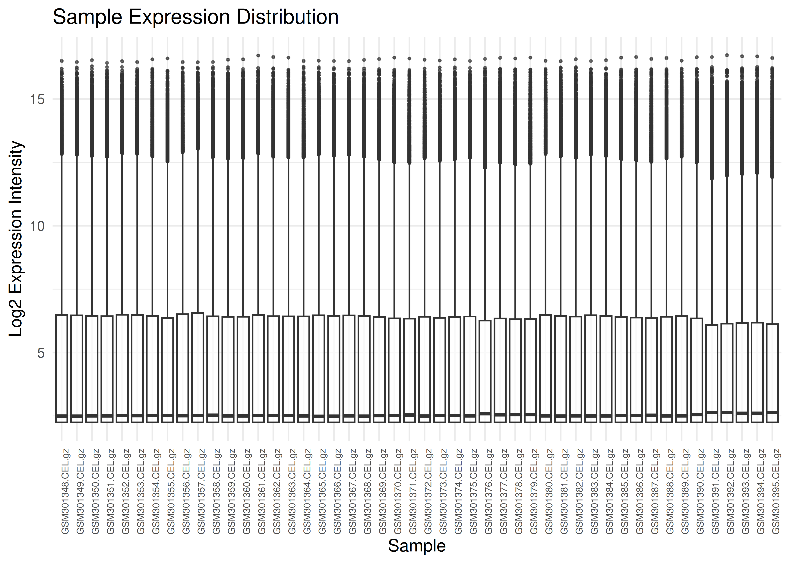
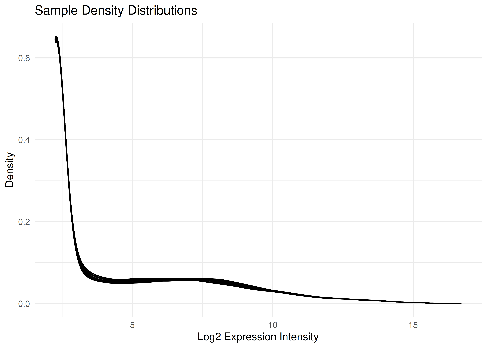
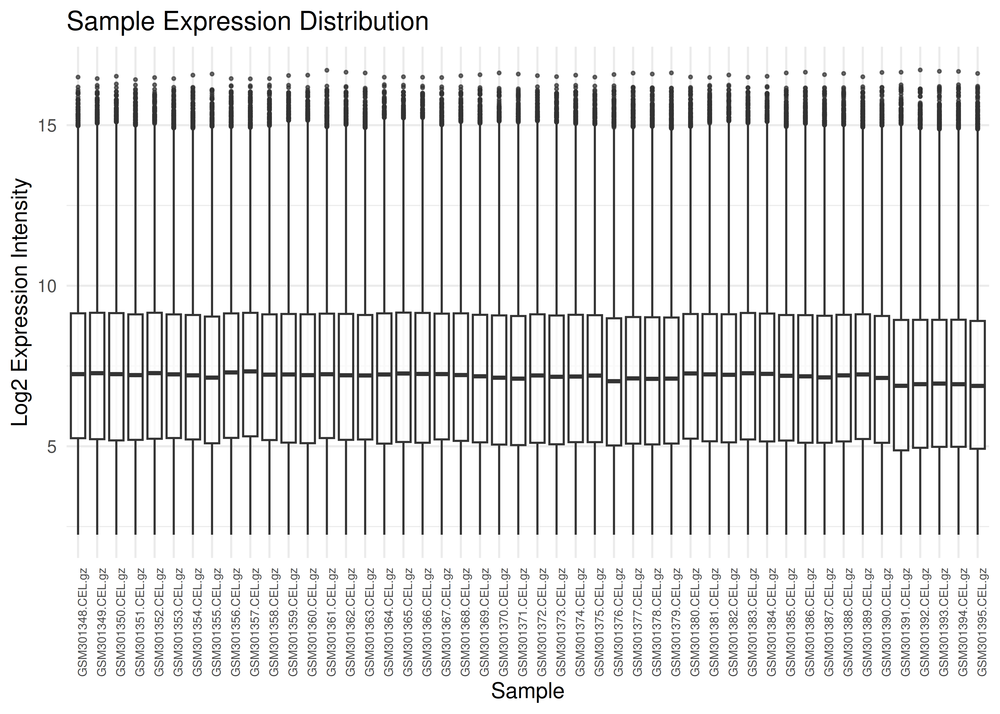
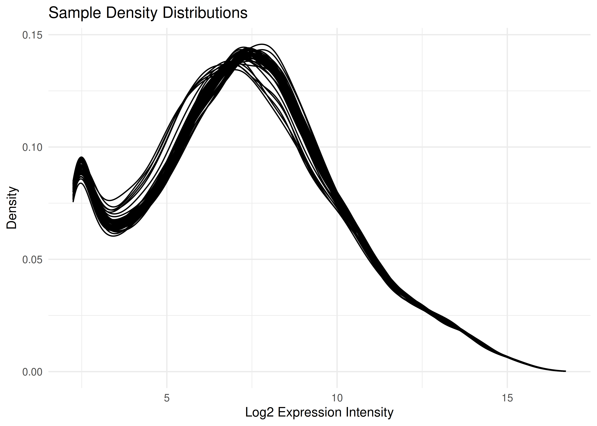
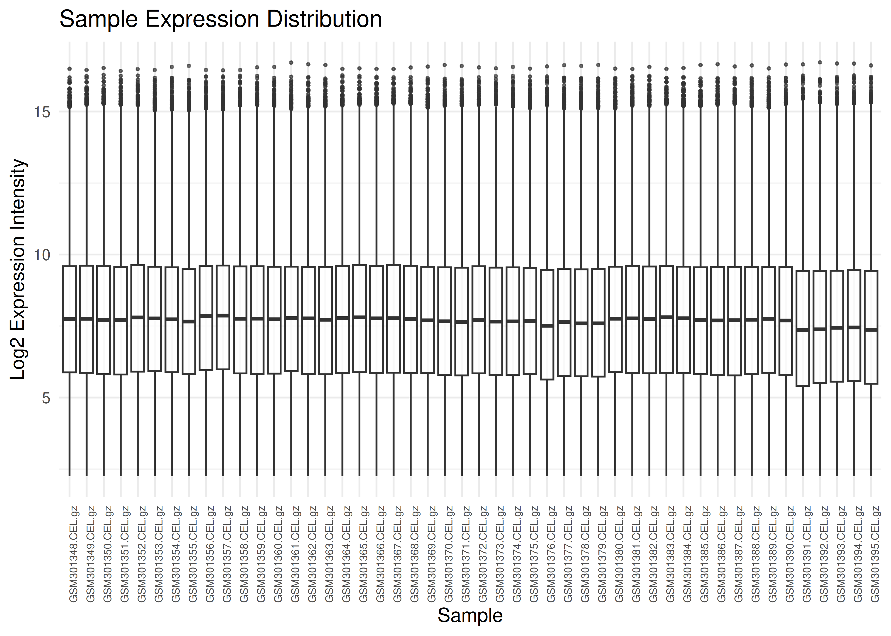
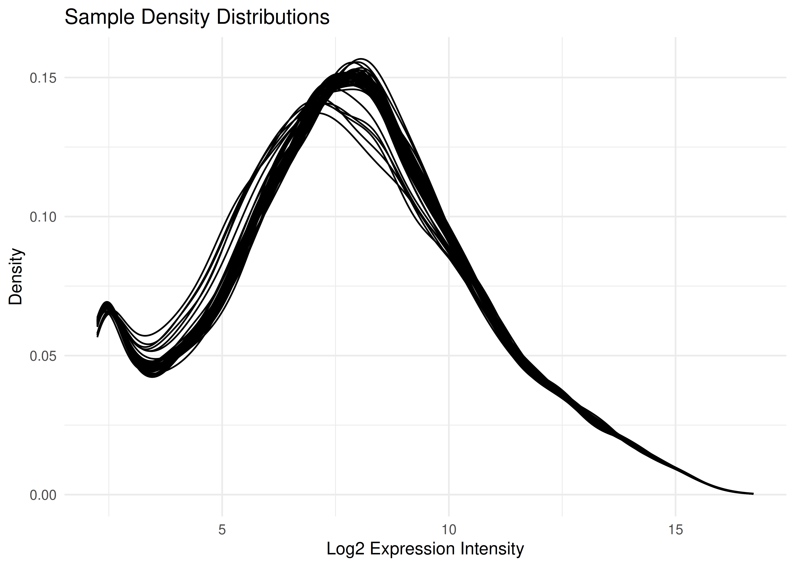

# Hughes2009: Tutorial and Data Processing

## Installation

``` r
# Install via pak
if (!requireNamespace("pak", quietly = TRUE)) install.packages("pak")
pak::pak("altintasali/Hughes2009")
```

## Raw Expression Data

First, we load the raw `eset` object and perform initial quality checks
to ensure data integrity.

``` r
show(eset)
#> ExpressionSet (storageMode: lockedEnvironment)
#> assayData: 45101 features, 48 samples 
#>   element names: exprs 
#> protocolData
#>   sampleNames: GSM301348.CEL.gz GSM301349.CEL.gz ... GSM301395.CEL.gz
#>     (48 total)
#>   varLabels: ScanDate
#>   varMetadata: labelDescription
#> phenoData
#>   sampleNames: GSM301348 GSM301349 ... GSM301395 (48 total)
#>   varLabels: title geo_accession ... relation.1 (33 total)
#>   varMetadata: labelDescription
#> featureData
#>   featureNames: 1415670_at 1415671_at ... AFFX-r2-P1-cre-5_at (45101
#>     total)
#>   fvarLabels: PROBEID SYMBOL GENENAME MAS5_CALL
#>   fvarMetadata: labelDescription
#> experimentData: use 'experimentData(object)'
#> Annotation: mouse4302
```

Here is how the expression matrix look like:

``` r
expression_matrix_raw <- exprs(eset)
print(expression_matrix_raw[1:6, 1:6])
#>              GSM301348.CEL.gz GSM301349.CEL.gz GSM301350.CEL.gz
#> 1415670_at          10.047478        10.144396        10.032522
#> 1415671_at          10.742481        10.572902        10.678695
#> 1415672_at          11.134648        11.113839        11.060911
#> 1415673_at           8.123238         8.375692         8.467279
#> 1415674_a_at         8.814808         8.788226         8.699853
#> 1415675_at           7.563833         7.303640         7.322527
#>              GSM301351.CEL.gz GSM301352.CEL.gz GSM301353.CEL.gz
#> 1415670_at           9.804604         9.990287         9.682311
#> 1415671_at          10.648379        10.714002        10.591531
#> 1415672_at          11.280906        11.074163        11.186339
#> 1415673_at           8.129796         8.236522         8.042468
#> 1415674_a_at         8.768019         8.587714         8.366756
#> 1415675_at           7.430643         7.668505         7.474612
```

### Boxplots

Visualizing expression distributions helps identify outliers or
normalization issues.

``` r
plot_boxplots(eset)
```



### Density Plots

Visualizing all 96 samples overlaid helps ensure there are no massive
outliers or batch effects in the normalization.

``` r
plot_densities(eset)
```



### MD Plots

In the
[`limma`](https://www.rdocumentation.org/packages/limma/versions/3.22.7)
R package, an MD plot (Mean-Difference plot) is a specific type of MA
plot used to visualize gene expression data. Its primary role in Quality
Control (QC) is to identify systematic biases and assess the
effectiveness of normalization.

Below is the MD plot for the first sample:

``` r
limma::plotMD(exprs(eset), column = 1)
```


## Filtering

Probes with low expression or inconsistent signal
([`MAS5`](https://www.rdocumentation.org/packages/affy/versions/1.44.0/topics/mas5calls)
“Absent” calls) can introduce noise. We filter the dataset to retain
only high-quality, reliable probes. You can play around with
`min_present` parameter below to find the optimum filtering option.

``` r
# Filter for probes present in at least 20 samples
eset_filt <- filter_mas5(eset, min_present = 20)

cat(sprintf("Original number of probes: %d\n", nrow(eset)))
#> Original number of probes: 45101
cat(sprintf("Probes remaining after filtering: %d\n", nrow(eset_filt)))
#> Probes remaining after filtering: 18207
```

It is also a good practice to run QC diagnostics after filtering.

### Box Plots

``` r
plot_boxplots(eset_filt)
```



### Density Plots

``` r
plot_densities(eset_filt)
```



### MD Plots

``` r
limma::plotMD(exprs(eset_filt), column = 1)
```


## Collapsing by Gene Name

Since multiple probes may target the same gene, we collapse the
probe-level data to the gene level using the
[`WGCNA`’s](https://www.rdocumentation.org/packages/WGCNA/versions/0.94)
[`collapseRows`](https://www.rdocumentation.org/packages/WGCNA/versions/0.94/topics/collapseRows)
function (`MaxMean` method).

``` r
eset_gene <- collapse_eset(eset_filt, method = "MaxMean")

expression_matrix_gene <- exprs(eset_gene)
print(expression_matrix_gene[1:6, 1:6])
#>               GSM301348.CEL.gz GSM301349.CEL.gz GSM301350.CEL.gz
#> 0610005C13Rik        10.284146        10.113265        10.205917
#> 0610010K14Rik         7.031768         7.184750         7.147965
#> 0610030E20Rik         7.544658         7.622270         7.650212
#> 0610040B10Rik         4.385660         4.527042         4.495156
#> 0610040J01Rik         8.168452         8.135460         7.934248
#> 0710001D07Rik         5.251084         4.523976         4.477646
#>               GSM301351.CEL.gz GSM301352.CEL.gz GSM301353.CEL.gz
#> 0610005C13Rik        10.158957        10.139734        10.150583
#> 0610010K14Rik         7.215943         7.087089         7.107502
#> 0610030E20Rik         7.823527         7.897321         8.062840
#> 0610040B10Rik         4.873537         4.765729         4.350292
#> 0610040J01Rik         8.032270         7.943563         7.893394
#> 0710001D07Rik         4.410543         4.265482         4.517288
```

### Box Plots

``` r
plot_boxplots(eset_gene)
```



### Density Plots

``` r
plot_densities(eset_gene)
```



### MD Plots

``` r
limma::plotMD(exprs(eset_gene), column = 1)
```


The final `eset_gene` object is now ready for downstream analysis, such
as differential expression testing with
[`limma`](https://www.rdocumentation.org/packages/limma/versions/3.22.7)
or gene co-expression network construction with
[`WGCNA`](https://www.rdocumentation.org/packages/WGCNA/versions/0.94).
